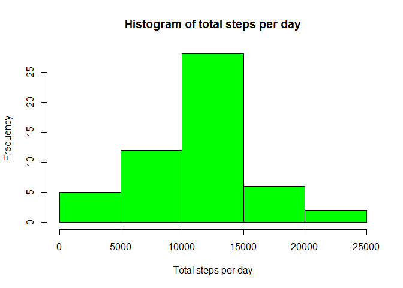
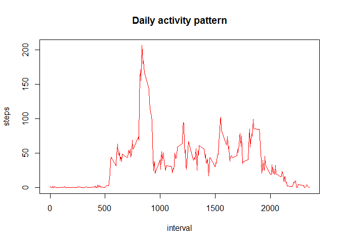
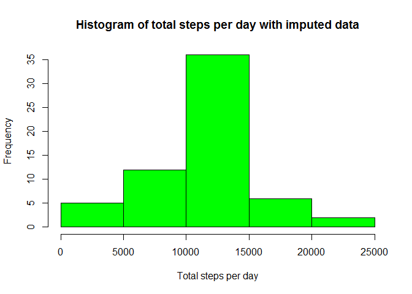
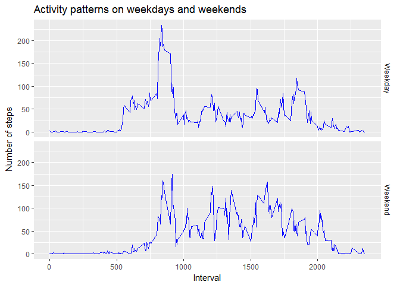

We look at the data collected from a human activity monitoring wearable device
that collects the number of steps taken by an anonymous individual throughout the day
at 5-minute intervals. The data is collected during the two months of 
October and November, 2012.  

Our objective is to look at the data and find any sensible patterns or trends with respect
to the number of steps taken during the day and over the period of meadurement.

## Loading and preprocessing the data

We set the working directory to the directory that has been forked from [Github](https://github.com/rdpeng/RepData_PeerAssessment1) and cloned into our computer.  

The data is available in the working directory as a csv file in zipped format. The file name is activity.zip .

The data can also be downloaded from [here](https://d396qusza40orc.cloudfront.net/repdata%2Fdata%2Factivity.zip).

We first unzip the file available in our working directory and read it into a variable as follows:


```r
csvfile <- unzip("activity.zip")
data <- read.csv(csvfile, header = TRUE)
```

Next we take a look at the data in the file:

```r
dim(data)
```

```
## [1] 17568     3
```

```r
head(data)
```

```
##   steps       date interval
## 1    NA 2012-10-01        0
## 2    NA 2012-10-01        5
## 3    NA 2012-10-01       10
## 4    NA 2012-10-01       15
## 5    NA 2012-10-01       20
## 6    NA 2012-10-01       25
```

```r
summary(data)
```

```
##      steps                date          interval     
##  Min.   :  0.00   2012-10-01:  288   Min.   :   0.0  
##  1st Qu.:  0.00   2012-10-02:  288   1st Qu.: 588.8  
##  Median :  0.00   2012-10-03:  288   Median :1177.5  
##  Mean   : 37.38   2012-10-04:  288   Mean   :1177.5  
##  3rd Qu.: 12.00   2012-10-05:  288   3rd Qu.:1766.2  
##  Max.   :806.00   2012-10-06:  288   Max.   :2355.0  
##  NA's   :2304     (Other)   :15840
```

We can see that the data has NA values.

We now carry out some analysis of the data in the dataset. We use the dplyr package to carry out the analysis.


```r
library(dplyr)
```

```
## 
## Attaching package: 'dplyr'
```

```
## The following objects are masked from 'package:stats':
## 
##     filter, lag
```

```
## The following objects are masked from 'package:base':
## 
##     intersect, setdiff, setequal, union
```

## What is mean total number of steps taken per day?
For this analysis, we ignore the missing (NA) values present in the data. We calculate the total number of steps taken each day by the individual, study the daily trend and then calculate the mean and median value of steps taken per day.


```r
require(graphics)

tot <- data %>% select(c(steps, date)) %>% 
    group_by(date) %>% summarise_at("steps", sum)
hist(tot$steps, xlab = "Total steps per day",
     main = "Histogram of total steps per day", col = "green")
```

<!-- -->

```r
meantot <- mean(tot$steps, na.rm = TRUE) %>% round(digits = 0) %>% as.integer()

require(stats)
medtot <- median(tot$steps, na.rm = TRUE)
```

We find that:

1. Mean of the total number of steps taken per day = 10766 (rounded off to the nearest integer)
2. Median of the total number of steps taken per day = 10765

## What is the average daily activity pattern?

To answer this question, we first find the average number of steps taken in each 5-minute interval, averaged across all days and plot it as a time series with the 5-minute interval (x-axis) and the average number of steps taken, averaged across all days (y-axis).


```r
require(graphics)

pat <- data %>% select(c(steps, interval)) %>% 
    group_by(interval) %>% summarise_at("steps", mean, na.rm=TRUE)
plot(pat, type = "l", col = "red", main = "Daily activity pattern")
```

<!-- -->

```r
mx <- max(pat$steps)
peak <- pat$interval[pat$steps==mx]
```

We see that the 835^th^ interval contains the maximum number of 206 steps, rounded off to the nearest integer.

## Imputing missing values

We now impute the missing (NA) values in the dataset by replacing the NA value for an interval with the corresponding mean for that interval across all the days, that was calculated by removing the NA values for that interval. 

We have already calculated the required mean values in the previous step, so we are going to reuse those values, just that we are going to round off those mean values to the nearest integer while imputing the data for missing number of steps.

We are going to copy the original data to a new variable for imputing the missing values, so as to keep the original data unchanged.


```r
newData <- data
chk <- match(newData$interval[is.na(newData$steps)==TRUE], pat$interval)
newData$steps[is.na(newData$steps)] <- round(pat$steps[chk], 0)
```

We now plot a histogram of toal steps taken each day with the imputed data:

```r
require(graphics)

newTot <- newData %>% select(c(steps, date)) %>% 
    group_by(date) %>% summarise_at("steps", sum)
hist(newTot$steps, xlab = "Total steps per day",
     main = "Histogram of total steps per day with imputed data", col = "green")
```

<!-- -->

We observe that there is an increase in the frequency of the days when the total number of steps taken is between 10000 and 15000.

We now recalculate the mean and median value of steps taken per day with the imputed data (we will again round off the mean value to the nearest integer):


```r
newMeantot <- mean(newTot$steps, na.rm = TRUE) %>% round(digits = 0) %>% as.integer()

require(stats)
newMedtot <- median(newTot$steps, na.rm = TRUE)
```

Next, we compare the new values of mean and median calculated after imputing the data with the previous values obtained without imputing the missing data:


```r
tab <- as.data.frame(cbind(c(meantot, medtot), c(newMeantot, newMedtot)))
names(tab) <- c("Old value", " New value")
row.names(tab) <- c("Mean steps per day", "Median steps per day")
tab
```

```
##                      Old value  New value
## Mean steps per day       10766      10766
## Median steps per day     10765      10762
```

We observe that the mean is unchanged although the median has slightly decreased due to the imputation.

## Are there differences in activity patterns between weekdays and weekends?

To answer this question, we classify each date in the dataset into weekdays and weekends. We consider the dates falling on Monday through Friday as weekdays and those falling on Saturdays and Sundays as weekends.

We then find the average number of steps taken, averaged across all weekday days or weekend days and plot it against the intervals of a day as a time series plot.

We use the original data with missing (NA) values for this analysis.


```r
withdays <- data %>% mutate(DOW = weekdays(as.Date(date))) %>%
    mutate(dayType = ifelse(!is.na(
        match(DOW, c("Saturday", "Sunday"))), "Weekend", "Weekday"))
daytot <- withdays %>% group_by(dayType, interval) %>% 
    summarise_at("steps", mean, na.rm = TRUE)

library(ggplot2)
```

```
## Warning: package 'ggplot2' was built under R version 3.4.4
```

```r
g <- ggplot(daytot, aes(interval, steps)) 
g <- g + xlab("Interval") + ylab("Number of steps")
g <- g + facet_grid(dayType~.)
g <- g + theme(strip.background = element_blank())
g <- g + geom_line(size = 0, col = "blue")
g <- g + ggtitle("Activity patterns on weekdays and weekends")
print(g)
```

<!-- -->
